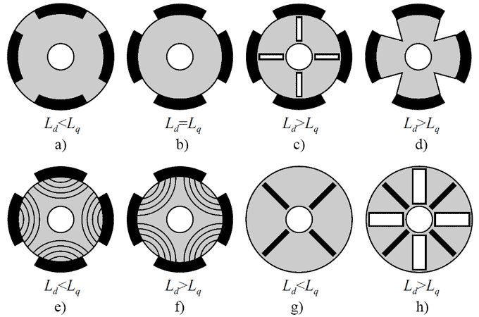

# Projekt dokumentáció – IPMSM alapú mezőorientált szabályozás

## 1. Bevezetés és célkitűzés

A projekt egy belső mágneses szinkron motor (IPMSM – Interior Permanent Magnet Synchronous Motor) mezőorientált szabályozásának (FOC – Field Oriented Control) numerikus szimulációjára épül. A cél egy olyan, modulárisan felépített Python-környezet kialakítása, amely:

* valósághű IPMSM elektromágneses és mechanikai modellt tartalmaz,
* háromfázisú, két­szintű invertert és szinuszos PWM modulációt modellez,
* többhurokú (sebesség + d–q áramhurkok) mezőorientált szabályozót valósít meg,
* mezőgyengítést alkalmaz a névleges fordulatszám fölötti tartományban,
* statikus és interaktív szimulációkat is biztosít, diagnosztikai jelrögzítéssel.

Az 1. ábra rendszerszintű blokkvázlata mutatja, hogyan épül fel a hajtáslánc: a DC táplálású két­szintű inverter szinuszos PWM-mel állítja elő a sztátor fázisfeszültségeket, az FOC pedig a d–q tengelyű áramokból kiindulva számítja a kívánt feszültségreferenciákat. A motor elektromágneses modellje és a mechanikai alrendszer eltérő időléptékben működik, ezért a szabályozási hurkok különböző mintavételezéssel futnak.

<p align="center">
  
</p>
<p align="center"><em>1. ábra: A projektben implementált IPMSM hajtás rendszerszintű blokkvázlata.</em></p>

A projekt kiegészítésként tartalmaz egy DC-motorra vonatkozó szimulációs keretrendszert is, amely egyszerűbb szabályozási struktúrákkal (nyitott hurkú, egyhurkú zárt szabályozás, kaszkád szabályozás) szolgál összehasonlítási alapként. A jelen dokumentáció viszont kifejezetten az IPMSM alapú FOC hajtásra koncentrál, és csak akkor tér ki a DC-motorra, amikor az segíti a PMSM modell megértését vagy a validációt.

A dokumentáció célja, hogy:

* áttekintse a fizikai modellt és a matematikai leírást (állapotváltozók, differenciálegyenletek),
* bemutassa a Clarke–Park transzformációkon alapuló mérőrendszert,
* részletesen ismertesse a mezőorientált szabályozó felépítését,
* elmagyarázza a mezőgyengítés működési elvét,
* leírja a szimulációs eszközök használatát (statikus és interaktív futtatás),
* javaslatokat adjon további fejlesztési irányokra.

---

## 2. Rendszer- és szoftverarchitektúra

A projekt főbb moduljai az `aut_project` csomagban, illetve a `simulations` könyvtárban találhatók:

* `ipmsm.py` – az IPMSM motor fizikai, d–q tengelyű modellje (`IPMSMMotor`),
* `transformations.py` – Clarke–Park és inverz transzformációk,
* `pwm.py` – szinuszos PWM modell (`SinusoidalPWM`),
* `inverter.py` – két­szintű háromfázisú inverter modell (`TwoLevelInverter`),
* `foc.py` – mezőorientált szabályozó (`FieldOrientedController`), mezőgyengítés (`FieldWeakeningController`) és hajtás futtató osztály (`FieldOrientedDrive`),
* `controllers.py` – általános PID és PI szabályozók,
* `simulation.py`, `dc_motor.py` – DC-motor szimulációs keret (referencia, összehasonlítás).

A szimulációkhoz tartozó scriptek:

* `simulations/simu_ipmsm_foc.py` – fix paraméterekkel futó, „statikus” FOC szimuláció, grafikonokkal,
* `simulations/simu_ipmsm_foc_interactive.py` – interaktív, csúszkákkal hangolható FOC szimulátor, valós időben frissülő görbékkel.

A belső modulok logikai kapcsolata a következő:

* A `FieldOrientedDrive` összekapcsolja a motort (`IPMSMMotor`), az invertert (`TwoLevelInverter`) és a szabályozót (`FieldOrientedController`).
* A `FieldOrientedController.step` a pillanatnyi fázisáramokból (`phase_currents`) Clarke–Park transzformációval számítja az (i_d, i_q) komponenseket, megoldja a sebesség és áram PI hurkokat, majd inverz Park transzformációval előállítja az alpha-beta feszültségreferenciákat.
* A `TwoLevelInverter.apply` ezeket a $(v_\alpha, v_\beta)$ komponenseket alakítja háromfázisú feszültséggé, és meghívja a `SinusoidalPWM.apply` függvényt, amely a DC-link feszültség korlátait figyelembe véve adja vissza a tényleges fázisfeszültségeket és kitöltési tényezőket.
* Az `IPMSMMotor.derivatives` a fázisfeszültségek alapján számítja az állapotváltozók deriváltjait, amelyekből az Euler-integrátor segítségével frissül a motor állapota.

A DC-motorral kapcsolatos `Simulation` osztály felépítése analóg: a különböző szimulációs módok (`open`, `closed`, `cascade`) jól párhuzamba állíthatók az IPMSM FOC többhurkú szabályozási struktúrájával. Ez a kontraszt rámutat arra, hogy a PMSM hajtás lényegesen összetettebb, elsősorban a többfázisú jelrendszer, a forgó koordináta-rendszerek és a mezőgyengítés miatt.

---

## 3. Az IPMSM topológiája, SPMSM-mel való összehasonlítás

A projektben vizsgált gép belső mágneses szinkron motor (IPMSM). Ennek fő jellemzője, hogy az állandó mágnesek a rotor belsejébe vannak süllyesztve (interior), nem pedig a rotor felületén helyezkednek el, mint a felületmágneses szinkron motoroknál (SPMSM – Surface PMSM).

<p align="center">
  
</p>
<p align="center"><em>2. ábra: Az IPMSM és a SPMSM vázlatos összehasonlítása. IPMSM esetén a mágnesek a rotor belsejében vannak, saliens gép alakul ki.</em></p>

Az IPMSM esetén:

* a rotorba süllyesztett ritkaföldfém mágnesek miatt a d- és q-tengely induktivitások eltérnek egymástól:
  $(L_d \neq L_q)$ (szaliens gép),
* a nyomatékképzés ezért két tagból áll: mágneses nyomaték és reluktancia nyomaték,
* mezőgyengítésnél a d-tengely áram (fluxus) aktív szabályozásával érhető el a névleges fordulatszám feletti tartomány.

A SPMSM esetén tipikusan $(L_d \approx L_q)$, így a reluktancia nyomaték elhanyagolható. Az IPMSM-ben viszont a reluktancia nyomaték kifejezetten kihasználható, például MTPA (Maximum Torque Per Ampere) szabályozási stratégiákkal. A jelen projekt ugyan nem tartalmaz teljes MTPA logikát, de a modell formája alkalmas lenne ilyen algoritmus kísérleti implementálására.

Az `IPMSMMotor` osztály konstruktora a következő fő paramétereket várja:

* `Rs` – sztátor fázisellenállás,
* `Ld`, `Lq` – d- és q-tengelyű induktivitások,
* `pole_pairs` – póluspárok száma,
* `psi_f` – állandó mágneshez kapcsolódó fluxus,
* `J` – teljes tehetetlenségi nyomaték (motor + terhelés),
* `B` – viszkózus csillapítás (súrlódás),
* `load_torque` – külső terhelőnyomaték.

A modell lehetővé teszi, hogy a `load_torque` paraméter akár futás közben is változzon, így dinamikus terhelésprofilok (pl. jármű hajtáslánc, ventilátor jelleggörbe) is szimulálhatók.

---

## 4. Elektromágneses és mechanikai modell

A motor elektromágneses része a d–q tengelyű ekvivalens áramkörön alapul. A d-tengelyen a mágnes fluxusa jelenik meg a q-tengely feszültségegyenletében, míg a q-tengelyen döntően a nyomatékképzés történik.

<p align="center">
  
</p>
<p align="center"><em>3. ábra: Az IPMSM d–q tengelyű ekvivalens áramköre.</em></p>

Az állapotvektor a `IPMSMMotor` modellben:

$$
x = [i_d,\ i_q,\ \omega_m,\ \theta_e]^\top
$$

ahol $(i_d, i_q)$ a d és q tengelyű áramok, $(\omega_m)$ a mechanikai szögsebesség, $(\theta_e)$ pedig az elektromos szög.

A d–q tengelyű feszültségegyenletek idealizált körülmények között:

$$
\dfrac{di_d}{dt} = \dfrac{v_d - R_s i_d + \omega_e L_q i_q}{L_d}
$$

$$
\dfrac{di_q}{dt} = \dfrac{v_q - R_s i_q - \omega_e (L_d i_d + \psi_f)}{L_q}
$$

ahol $(\omega_e = p \cdot \omega_m)$ az elektromos szögsebesség ($p$ a póluspárok száma). Ezek pontosan visszaköszönnek az `IPMSMMotor.derivatives` implementációjában.

A villamos részhez kapcsolódó nyomatékképzés:

$$
T_e = 1{,}5 \cdot p \cdot \left( \psi_f i_q + (L_d - L_q) i_d i_q \right)
$$

amelyben az első tag a mágneses nyomaték, a második pedig a reluktancia nyomaték. Ez a felbontás magyarázza, miért lehet az IPMSM esetén a d-tengely áramot nem csupán nullára szabályozni, hanem adott körülmények között negatív irányba tolni (mezőgyengítés, MTPA).

A mechanikai alrendszer differenciálegyenlete:

$$
J \dfrac{d\omega_m}{dt} = T_e - B \omega_m - T_{\text{load}}
$$

ahol $(T_{\text{load}})$ a `load_torque` paraméterrel szabályozható külső terhelőnyomaték. Az `IPMSMMotor.derivatives` a fenti egyenleteket numerikusan implementálja, és `numpy` vektorokkal adja vissza a deriváltakat.

A rotor szögének változása elektromos koordinátában:

$$
\dfrac{d\theta_e}{dt} = \omega_e = p \cdot \omega_m
$$

A `FieldOrientedDrive.run` metódusban a `state[3]` értéket minden lépés után $(2\pi)$ modulóval normalizáljuk, hogy numerikusan stabil maradjon a Park-transzformáció (a szinusz és koszinusz függvények argumentumaként felesleges lenne egyre nagyobb szögeket tárolni).

---

## 5. Koordináta-transzformációk és mérési tengelyek

A háromfázisú jelrendszer kezeléséhez a klasszikus Clarke–Park transzformációkat alkalmazzuk, amelyeket a `transformations.py` modul valósít meg.

**Clarke-transzformáció (abc → αβ):**

$$
\alpha = \frac{2a - b - c}{3}, \qquad
\beta = \frac{b - c}{\sqrt{3}}
$$

Ez a transzformáció a háromfázisú jeleket egy kétdimenziós, állórészhez kötött, ortogonális koordináta-rendszerbe vetíti.

**Park-transzformáció (αβ → d q):**

$$
d = \alpha \cos\theta + \beta \sin\theta
$$

$$
q = -\alpha \sin\theta + \beta \cos\theta
$$

ahol $(\theta)$ az elektromos rotor szög. A d–q rendszer a rotorhoz kötött, forgó koordináta-rendszer, ami lehetővé teszi a fluxus és nyomaték komponensek szétválasztását.

**Inverz Park és Clarke (dq → αβ → abc):**
A feszültségreferenciákat a d–q tengelyen számítjuk, majd az `inverse_park` és `inverse_clarke` függvényekkel alakítjuk vissza háromfázisú feszültséggé, mielőtt az inverterre kerülnek.

A `FieldOrientedController.step` függvény elején:

* a fázisáramokból (`phase_currents`) Clarke→Park transzformációval számoljuk az $(i_d, i_q)$ értékeket,
* a szabályozás a d–q tengelyen történik,
* a végén a d–q feszültségeket visszaforgatjuk az állórészhez kötött αβ rendszerbe.

Ez a strukturált „tengely kezelés” teszi lehetővé, hogy a háromfázisú gép szabályozásszempontból két, közel független SISO rendszerre essen szét (fluxus/d és nyomaték/q).

---

## 6. Térorientált szabályozási struktúra (FOC)

A mezőorientált szabályozó (`FieldOrientedController`) két fő hurkot valósít meg:

**Külső sebességhurok:**

* bemenete a mért mechanikai sebesség $(\omega_m)$,
* referencia a `speed_reference` jel (pl. Heaviside lépcső a `simu_ipmsm_foc.py` scriptben),
* kimenete egy $(i_q)$ jelhez hozzájáruló nyomatékigény, amelyet a `speed_controller` PI szabályozó állít elő.

**Belső d–q áramhurkok:**

* d-tengelyen a fluxus referencia (`id_reference`, módosítva mezőgyengítéskor),
* q-tengelyen az összesített $(i_q)$ referencia (sebesség PI + opcionális `torque_reference`),
* a két PI szabályozó (`id_controller`, `iq_controller`) kimenete d–q feszültségreferencia, amelyet *decoupling* (előrecsatolási) tagokkal módosítunk.

A d–q feszültség parancsok a csatoló tagokkal:

$$
v_d^{ff} = v_{d,PI} - \omega_e L_q i_q
$$

$$
v_q^{ff} = v_{q,PI} + \omega_e (L_d i_d + \psi_f)
$$

Ez a strukturált előrekompenzáció csökkenti a d–q tengelyek közötti kölcsönhatást, így a gyors fel- és lefutási tranziens során is viszonylag szétcsatolt szabályozást érünk el.

A `FieldOrientedController.step` időzítés szempontjából több frekvenciát használ:

* a sebességhurok (`speed_controller.dt`) lassabb, tipikusan 2 kHz körüli,
* az áramhurkok (`id_controller.dt`, `iq_controller.dt`) gyorsabbak, pl. 10 kHz,
* a mezőgyengítés (`field_weakening.dt`) még ritkábban frissülhet, hogy ne vigyen zajt a gyors hurkokba.

A különböző frekvenciákat a `_speed_next_update`, `_id_next_update`, `_iq_next_update` és `_fw_next_update` belső időbélyegek kezelik: az adott rész csak akkor frissül, ha az aktuális idő átlépte a következő frissítési időpontot.

---

## 7. Mezőgyengítés és fordulatszám-tartomány kiterjesztése

A mezőgyengítés célja, hogy a rendelkezésre álló DC-link feszültség mellett is elérhető legyen a névleges fordulatszám feletti üzem. Ehhez a d-tengely áramreferenciát (azaz a fluxust) úgy módosítjuk, hogy a feszültségvektor nagysága ne lépje túl az inverter által biztosítható maximumot.

Ezt a logikát a `FieldWeakeningController` valósítja meg:

* `voltage_limit`: az inverter αβ síkban értelmezett feszültségkorlátja (`TwoLevelInverter.alpha_beta_limit`),
* `attack_gain`, `release_gain`: külön „támadó” és „elengedő” erősítés, hogy az $(i_d)$ referencia ne oszcilláljon túlzottan,
* `deadband`: holtsáv, amely meghatározza, hogy mekkora eltérést tekintünk érdemi túllépésnek vagy tartaléknak,
* `id_min`, `id_max`: biztonságos tartomány a d-tengely áramra (mezőgyengítés tipikusan negatív $(i_d)$ felé tolja a parancsot).

A mezőgyengítés menete:

* A FOC kiszámítja a d–q feszültségparancsot $(v_d^{ff}, v_q^{ff})$, amelyhez tartozik egy $(|v| = \sqrt{v_d^2 + v_q^2})$ nagyság.
* Ha $(|v|)$ megközelíti vagy meghaladja a `voltage_limit` értéket, a `FieldWeakeningController.update` a `base_id`-től negatívabb $(i_d) $ parancs felé tolja a belső `_id_cmd` értéket.
* Ha a feszültség tartalékkal a limit alatt van, a `release_gain` segítségével a mezőgyengítés „elengedi” a d-tengely áramot, fokozatosan visszatérve a bázis értékhez.

Az aktuális $(i_d)$ referencia a FOC-ban `_id_ref_cmd` néven szerepel, és ebből képződik a d-tengely PI szabályozó referenciajele.

A mezőgyengítés frissítése `field_weakening.dt` időközönként történik, ami jó kompromisszum a reagálási sebesség és a jelzaj között.

---

## 8. Inverter és szinuszos PWM modell

A teljesítményelektronikai rész két fő komponensből áll:

### Szinuszos PWM modell (`SinusoidalPWM`)

Bemenet: kívánt fázisfeszültség `v_ref` és a DC-link feszültség `vdc`.

A modell a feszültséget $(\pm v_{dc}/2)$ tartományra korlátozza:

$$
v_{\text{actual}} = \text{clip}\left(v_{\text{ref}}, -\tfrac{1}{2}v_{dc}, \tfrac{1}{2}v_{dc}\right)
$$

A kitöltési tényező:

$$
d = 0{,}5 + \frac{v_{\text{actual}}}{v_{dc}}
$$

majd 0 és 1 között korlátozva.

A `voltage_limit` property egyszerűen `0.5 * vdc`, ami megfelel a szinuszos PWM feszültségkorlátjának.

### Két­szintű inverter modell (`TwoLevelInverter`)

Bemenet: $(v_\alpha, v_\beta)$ feszültség referenciák és az idő `t`.

* Először inverz Clarke-transzformációval három fázisreferenciát képez:
  $(v_a^{\text{ref}}, v_b^{\text{ref}}, v_c^{\text{ref}})$.
* Mindegyik fázisra meghívja a PWM modellt (`pwm.apply`), így megkapja a tényleges fázisfeszültségeket és a duty-kat.
* Az `alpha_beta_limit` property innen adja tovább a PMSM szabályozó felé a feszültségvektor αβ síkban érvényes korlátját, amit a mezőgyengítő is használ.

A jelenlegi megvalósítás ideális elemekkel dolgozik (nincs holtidő, nincs félvezető veszteség, nincs holtidő kompenzáció), ami tiszta felületet biztosít a szabályozási algoritmusok vizsgálatára. Ugyanakkor az inverter interfész elegendően moduláris ahhoz, hogy a jövőben SVPWM, többfázisú inverter vagy nemideális modell is beilleszthető legyen.

---

## 9. Szimulációs futtató lánc és numerikus integráció

A szimulációs alapot a `FieldOrientedDrive` osztály adja, amely:

* egy adott motor példányt (`IPMSMMotor`),
* egy inverter példányt (`TwoLevelInverter`),
* és egy controller példányt (`FieldOrientedController`)

kap a konstruktorban. A `run(duration, dt, x0=None)` függvény:

* Létrehozza az idővektort:
  `t_values = np.linspace(0.0, duration, steps, endpoint=False)`,
  ahol `steps = int(duration / dt)`.
* Inicializálja a motor állapotát (`motor.initial_state()`), vagy a felhasználó által megadott `x0` szerint.
* Előkészít egy `results` szótárat, amely többek között a következőket tárolja:

  * `time`, `phase_voltages`, `phase_currents`,
  * `d_currents`, `q_currents`,
  * `speed`, `electrical_angle`,
  * `torque`, `torque_ref`, `load_torque`,
  * `i_d_ref`, `i_q_ref`, `omega_ref`,
  * `voltage_magnitude`, `voltage_saturated`,
  * `duty_cycles`.

Minden időlépésben:

* meghívja a `controller.step` függvényt, amely visszaadja a kívánt `v_alpha_beta` feszültségeket és egy `debug` szótárat,
* az inverterből (`inverter.apply`) megkapja a tényleges fázisfeszültségeket és duty-okat,
* a motor differenciálegyenleteit (`motor.derivatives`) felhasználva Euler-lépéssel frissíti az állapotot,
* normalizálja az elektromos szöget: `state[3] = np.mod(state[3], 2.0 * np.pi)`,
* visszaszámítja a fázisáramokat (`motor.phase_currents`),
* kiszámítja az elektromágneses nyomatékot (`motor.electromagnetic_torque`),
* eltárolja az összes releváns jelet a `results` struktúrában.

A `simu_ipmsm_foc.py` script konkrét szimulációt épít erre:

```python
motor = IPMSMMotor(
    Rs=0.35,
    Ld=1.4e-3,
    Lq=2.6e-3,
    pole_pairs=4,
    psi_f=0.055,
    J=8.5e-4,
    B=2e-4,
    load_torque=0.2,
)
pwm = SinusoidalPWM(vdc=48.0, carrier_freq=10_000.0)
inverter = TwoLevelInverter(vdc=48.0, pwm=pwm)
speed_reference = Heaviside(value=50.0, delay=0.02)
```

A PI erősítéseket úgy választjuk meg, hogy stabil átmenetet és elfogadható túllendülést kapjunk, miközben a mezőgyengítés szükség esetén bekapcsol. A futtatás végén egy Matplotlib alapú `plot_results` funkció rajzolja ki a sebesség, áramok, feszültségek és nyomaték görbéit.

A tipikus futtatási paraméterek:

* `vdc = 48 V`,
* `carrier_freq = 10 kHz`,
* `duration ≈ 0.15–0.2 s`,
* `dt = 5e-6…2e-5 s`,

olyan kompromisszumot jelentenek, amely mellett a modell numerikusan stabil, és a fontos dinamikák (PWM, áramhurkok, sebesség hurok) is kellő felbontással láthatók.

---

## 10. Interaktív FOC hangoló felület

A `simu_ipmsm_foc_interactive.py` script egy Matplotlib alapú GUI-t hoz létre csúszkákkal, amelyekkel menet közben állíthatók a szabályozó paraméterei:

* sebesség PI: `speed_kp`, `speed_ki`,
* d-tengely PI: `id_kp`, `id_ki`,
* q-tengely PI: `iq_kp`, `iq_ki`,
* mezőgyengítés: `fw_attack`, `fw_release`,
* referenciajel: `speed_ref`,
* terhelés: `load_torque`.

A `SLIDER_SPECS` lista az egyes csúszkák címkéit és minimum/maximum tartományát definiálja. A `build_drive` függvény a paraméterekből újraépíti a hajtást (motor + inverter + FOC), a `run_simulation` pedig lefuttatja a szimulációt.

A grafikonok kezelését a `PlotHandles` dataclass egyszerűsíti: a vonalobjektumokat (sebesség, áramok, feszültségek, nyomatékok) egyszer inicializáljuk, utána csak az adatokat frissítjük. Ez sokkal hatékonyabb, mint minden változtatásnál újra létrehozni az ábrákat.

<p align="center">
  
</p>
<p align="center"><em>4. ábra: Interaktív szimulációs felület a PI erősítések és a mezőgyengítés hangolásához.</em></p>

---

## 11. Tipikus szimulációs eredmények és diagnosztika

A statikus szimuláció (`simu_ipmsm_foc.py`) eredményeit a `plot_results` függvény jeleníti meg, jellemzően négy egymás alatti diagramon:

**Sebesség és sebesség referencia:**

* várható, hogy a sebesség $(\omega_m)$ néhány tizedmásodpercen belül követi a Heaviside referencia lépcsőt,
* túllendülés, beállási idő, stacionárius hiba a `speed_kp`, `speed_ki` paraméterekkel hangolható.

**d–q áramok és referenciaik:**

* az $(i_q)$ áram követi a nyomaték és sebességigény által meghatározott `i_q_ref` jelet,
* az $(i_d)$ általában egy konstans vagy mezőgyengítéskor kissé negatív érték körül szabályozott.

**Fázisfeszültségek:**

* a három fázisfeszültség szinuszszerű, egymáshoz képest 120° fázistolással,
* a mezőorientált szabályozás révén a feszültségvektor forgó, közel kör alakú pályát ír le az αβ síkban.

**Elektromágneses és terhelő nyomaték:**

* a `torque` görbe követi a terhelő nyomatékot (`load_torque`),
* gyors terhelésváltásnál jól láthatók a szabályozási tranziens jelenségek.

<p align="center">
  
</p>
<p align="center"><em>5. ábra: Tipikus szimulációs eredmények az IPMSM FOC hajtásról.</em></p>

A DC-motoros `Simulation` modul eredményeivel összehasonlítva jól látható, hogy az IPMSM FOC esetén sokkal több jelre és összetettebb diagnosztikai eszköztárra van szükség, ugyanakkor a mezőorientált szabályozás cserébe rendkívül precíz nyomaték- és sebességszabályozást tesz lehetővé.

---

## 12. Összegzés és továbbfejlesztési irányok

A projekt egy kompakt, de szakmailag jól strukturált IPMSM FOC szimulációs környezetet valósít meg. A fő erősségek:

* **Tiszta modellstruktúra:**
  külön modulokra bontott motor, inverter, PWM, transzformációk és szabályozók.
* **Valósághű IPMSM modell:**
  szaliens gép $(L_d \neq L_q)$, reluktancia nyomaték, mezőgyengítési lehetőség.
* **Rugalmasság:**
  könnyen módosíthatók a motorparaméterek, a szabályozási erősítések és terhelésprofilok.
* **Interaktív hangolás:**
  a GUI-val nagyon rövid idő alatt megtapasztalhatók a PI erősítések, a mezőgyengítés vagy a terhelésváltozások hatásai.

Lehetséges továbbfejlesztési irányok:

* **MTPA és fejlettebb szabályozási stratégiák:**
  az IPMSM modell alkalmas MTPA jellegmezők, hatásos/teljesítményoptimalizáló szabályozás, vagy akár fluxus-optimalizálás vizsgálatára.
* **SVPWM és nemideális inverter modell:**
  térerővektoros moduláció (SVPWM) beépítésével növelhető a kihasználható feszültségvektor tartomány; nemideális kapcsolók, holtidő és feszültségveszteségek modellje közelebb hozná a rendszert a valóságos hajtásokhoz.
* **Szenzormentes szabályozás:**
  rotorpozíció- és sebességbecslők (pl. EMF-alapú, observer-alapú módszerek) beépítése a transzformációs láncba.
* **Hőmérsékletfüggő paraméterek:**
  ellenállás, induktivitások és mágneses fluxus hőmérsékletfüggésének modellezése, ami a gyakorlati hajtásoknál kritikus jelentőségű.
