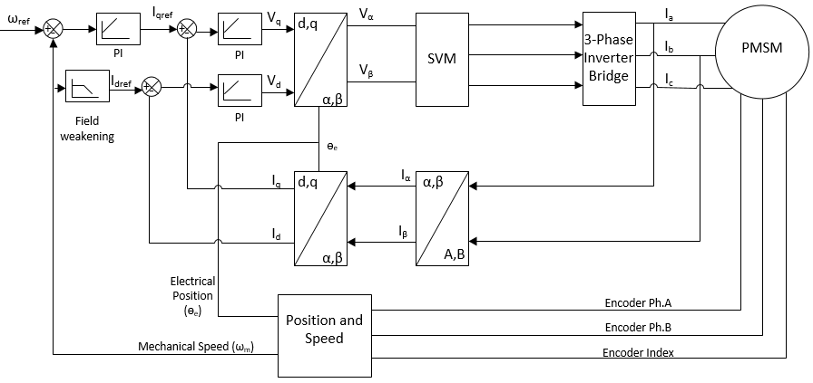
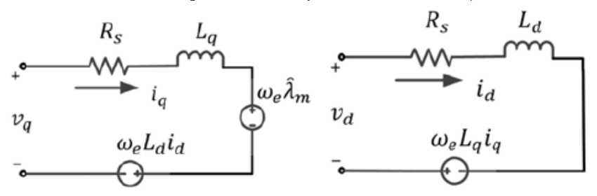
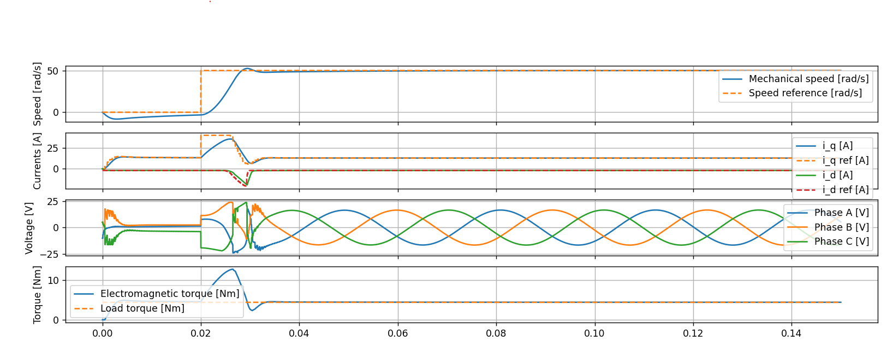
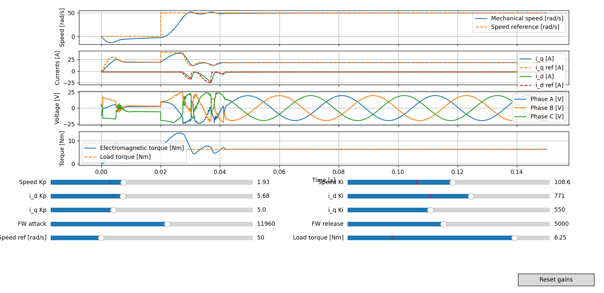

# Projekt dokumentáció – IPMSM alapú térorientált szabályzás

## 1\. Bevezetés

Az 1. ábra rendszerszintű blokkvázlata mutatja, hogyan épül fel a projektben implementált háromfázisú hajtáslánc: a DC táplálásból felépített két szintű inverter szinuszos PWM-mel biztosítja a sztátor feszültségeket, amelyeket az FOC állít elő az IPMSM motor elektromágneses modellje alapján. A blokkvázlat arra is rámutat, hogy az elektromos és mechanikai tartományok különböző időléptékben viselkednek, ezért a szabályozási hurkok eltérő mintavételezéssel futnak.

*1. ábra: A projektben implementált hajtáslánc rendszerszintű blokkvázlata.*

A projekt célja, hogy szimuláljunk egy IPMSM motort, valós idejű mezőgyengítéssel, adaptív áramkörökkel és interaktív vizualizációval. A dokumentáció ezért végigköveti a teljes fejlesztési folyamatot a motormodelltől az inverteren át egészen a szoftverarchitektúráig, és kitér a validációs módszerekre is.

Bár a repó tartalmaz egy klasszikus egyenáramú motorra vonatkozó moduláris szimulátort is, a jelen leírás kifejezetten a belső mágneses szinkron motorra (IPMSM) fókuszál. A DC részleggel kapcsolatos elemeket csak akkor érintjük, amikor azok segítik a PMSM modell értelmezését vagy az eredmények összehasonlítását.

-----

## 2\. Rendszer- és szoftveráttekintés

A `ipmsm.py` tartalmazza a motor fizikai modelljét, a `transformations.py` a Clarke–Park transzformációkat, a `pwm.py` és `inverter.py` a nagyfrekvenciás teljesítményelektronikai részt, míg a `foc.py` felel a teljes térorientált szabályozásért és a szimulációs meghajtásért (`FieldOrientedDrive`).

A `simulations` könyvtár több belépési pontot kínál: a `simu_ipmsm_foc.py` skript reprodukálja az alap hajtási manővert, míg a `simu_ipmsm_foc_interactive.py` GUI csúszkákkal teszi hangolhatóvá a PI erősítéseket, a mezőgyengítés paramétereit és a terhelőnyomatékot. E két szkript ugyanarra a magmodulokra épít, így könnyű azonosítani a hatásukat a motor és az inverter viselkedésére.

A DC motorokat érintő `simulation.py` modul különálló történet: a `Simulation.simulate_*` függvények egyszerű Euler-integrátorral dolgoznak, és csupán referenciaként szolgálnak ahhoz, hogy lássuk, mennyivel összetettebb egy IPMSM vezérlése. Ezen felül a PMSM-hez kapcsolódó modulok időlépés- és referencia-kezelése sokkal kifinomultabb, amit a későbbi fejezetek részletesen tárgyalnak.

-----

## 3\. Az IPMSM fizikai felépítése és paraméterei

A rotorba süllyesztett ritkaföldfém mágnesek golyó alakú fluxusútvonalat hoznak létre, ami miatt a d- és q-tengely induktivitások eltérnek egymástól ($Ld \neq Lq$).

A `IPMSMMotor` osztály konstruktora hat kulcsparamétert vár (`Rs`, `Ld`, `Lq`, `pole_pairs`, `psi_f`, `J`) és opcionálisan a viszkózus súrlódási tényezőt (`B`) valamint a gépre jutó külső terhelőnyomatékot (`load_torque`). Ezek a paraméterek közvetlenül jelennek meg a differenciálegyenletekben, és a kód pontosan követi a gyártói adatlapok jelöléseit, így egyszerű a laborban mért értékek becsatornázása.

A mechanikai alrendszert a tehetetlenségi nyomaték (`J`) és a viszkózus veszteség (`B`) reprezentálja, amelyek szorosan kapcsolódnak a hajtott terheléshez. A modell lehetővé teszi, hogy akár dinamikus terhelőnyomaték-profilt (`motor.load_torque`) állítsunk be futás közben, ami nagy segítség a járműdinamikai tesztekben.

-----

## 4\. Elektromágneses és mechanikai modell

A 2. ábrán látható d–q tengelyű ekvivalens áramkörből vezetjük le a belső állapotok differenciálegyenleteit. A `IPMSMMotor.derivatives` függvény a valós időben számított feszültségkomponenseket (`v_d`, `v_q`) használja, majd a lineáris villamos köröknek megfelelően képezi a `di_d` és `di_q` deriváltakat.

*2. ábra: Az IPMSM d-q tengelyű ekvivalens áramköre.*

Idealizált körülmények között a modell a következő összefüggésekre támaszkodik: $di_d/dt = (v_d - Rs \cdot i_d + \omega_e \cdot L_q \cdot i_q) / L_d$ és $di_q/dt = (v_q - Rs \cdot i_q - \omega_e \cdot (L_d \cdot i_d + \psi_f)) / L_q$. Ezek az egyenletek jól mutatják, hogy a q-tengelyen fellépő feszültség az állandó mágneses fluxus miatt kölcsönösen csatolt a d-tengely áramához.

A villamos részhez csatlakozik a nyomatékképzés: $T_e = 1.5 \cdot p \cdot (\psi_f \cdot i_q + (L_d - L_q) \cdot i_d \cdot i_q)$. Ez az összefüggés kulcsfontosságú, mert megmutatja, hogy miért képes a mezőgyengítés megváltoztatni a nyomatékfordulat arányt.

A mechanikai alrendszerben a $J \cdot d(\omega_m)/dt = T_e - B \cdot \omega_m - T_{load}$ differenciálegyenlet írja le az átmeneti dinamikát. A modell ellentétes előjelű `load_torque` bemenete lehetővé teszi, hogy gyors terhelésváltozásokat injektáljunk a szimulációba.

-----

## 5\. Mérési tengelyek és transzformációk

A fázisáramokból Clarke-transzformációval (`clarke_transform`) `alpha-beta` komponenseket képzünk, majd Park-transzformációval (`park_transform`) a forgó `d-q` koordinátarendszerbe vetítjük őket.

A `FieldOrientedController.step` függvény elején ennek megfelelően `i_alpha`, `i_beta`, majd `i_d`, `i_q` kerül kiszámításra, miközben a rotor szöge (`theta_e`) a `IPMSMMotor` állapotából érkezik. A transzformációk inverzei (`inverse_park`, `inverse_clarke`) biztosítják, hogy a kiszámított referenciafeszültségeket vissza tudjuk alakítani a háromfázisú inverter bemenetévé.

A transzformációs lánc implementációja moduláris, így a jövőben könnyen beilleszthetők szenzorfúziós algoritmusok vagy becsült rotorpozíciók is.

## 6\. Térorientált szabályozási struktúra

A külső sebességhurok PI-szabályzója (`speed_controller`) lassabb időlépcsővel fut, és a referencia nyomatékot illetve az `i_q` áramkomponenst állítja elő. A belső áramhurkok (`id_controller`, `iq_controller`) jóval magasabb frekvencián mintavételeznek.

A FieldOrientedController.step függvény a d- és q-tengelyen külön PI-szabályzókat tart fenn, amelyekhez decoupling feedforward tagok társulnak. A $v_{d\_ff} = v_{d\_pi} - \omega_e \cdot L_q \cdot i_q$ és $v_{q\_ff} = v_{q\_pi} + \omega_e \cdot (L_d \cdot i_d + \psi_f)$ kifejezések biztosítják, hogy a tengelyek közötti csatolás minimális legyen, így javul a gyorsulási tranziens.

A sebességhurok által számított `i_q` referencia `_iq_ref_last` néven kerül eltárolásra, amelyhez hozzáadódik a felhasználó által adott mechanikai nyomaték-előírás (`torque_reference`). Az így kapott `_iq_total_ref` értéket követi az `iq_controller`, miközben a d-tengelyen az `id_controller` a fluxus-szabályozást végzi.

Ha a `voltage_limit` alapján számított feszültségvektor meghaladná a rendelkezésre álló inverterkört, akkor a vezérlő arányosan visszaskálázza a `v_d` és `v_q` komponenseket, és a logikai jelek (`voltage_saturated`) naplózásra kerülnek.

-----

## 7\. Mezőgyengítés és sebességhatár kiterjesztése

A `FieldWeakeningController` osztály figyeli a `voltage_magnitude` értéket, és ha az meghaladja a `voltage_limit` értéket, akkor negatívabb `i_d` referencia felé tolja a parancsot.

A mezőgyengítő szabályozóban külön támadó és elengedő erősítés szerepel (`attack_gain`, `release_gain`), hogy elkerüljük a fűrészfog-szerű viselkedést. A `deadband` paraméter határozza meg, milyen mértékű túllépést tekintünk érdemi jelnek.

A mezőgyengítés beavatkozásának pontját `field_weakening.dt` szerint diszkrét időlépésben frissítjük. Így biztosított, hogy a magas frekvenciájú áramhurkokba nem kerül fölösleges zaj, miközben a nagy sebességű tartományban is követni tudjuk a feszültségkorlátot.

## 8\. Inverter és moduláció

A `SinusoidalPWM` modul a vivőfrekvenciát (`carrier_freq`) és a DC-link feszültséget (`v_dc`) paraméterként veszi fel, majd `TwoLevelInverter.apply` hívásakor generálja a pillanatnyi fázisfeszültségeket.

A moduláció kimenete a `FieldOrientedDrive` eredményeiben `phase_voltages` és `duty_cycles` tömbökként is megjelenik.

A jövőbeli bővítésekhez a moduláris inverter-interfész lehetővé teszi például, hogy helyettesítsük a `SinusoidalPWM`-et térvektoros modulációval vagy többfázisú kiterjesztésekkel.

## 9\. Szimulációs futtatási lánc

Először a vezérlő kiszámítja a kívánt `alpha-beta` feszültségeket, majd az inverter előállítja a fázisfeszültségeket, végül a motor differenciálegyenleteit numerikusan integráljuk.

A kód az `np.linspace` segítségével hozza létre az idővektort, és minden iterációban Euler-lépéssel ($state = state + dt \cdot derivatives$) frissíti az állapotokat. A rotor szögét `mod 2 * pi` normalizáljuk, hogy numerikusan stabil maradjon a Park-transzformáció.

A `Results` struktúra több mint egy tucat jelcsatornát tárol, köztük a `d_currents`, `q_currents`, `speed`, `torque`, `omega_ref`, `i_d_ref`, `i_q_ref`, valamint a `voltage_saturated` logikai maszkot.

## 10\. Tipikus szimulációs eredmények és diagnosztika

A 11. ábrán a `simu_ipmsm_foc.py` futásának főbb görbéi láthatók: a felső grafikonon a mechanikai sebesség és a referencia, alatta az `i_q` és `i_d` áramok referenciával, majd a fázisfeszültségek és végül az elektromágneses illetve terhelőnyomaték. Ezeket a grafikonokat a `plot_results` függvény építi fel Matplotlib segítségével.

A futási paraméterek (48 V DC-link, 10 kHz vivő, 0.2 s futásidő, 5 us integrációs lépés) úgy  vannak megválasztva, hogy a rendszer stabilan fusson.

*11. ábra: Tipikus szimulációs eredmények IPMSM FOC hajtásról.*

## 11\. Interaktív hangolási felület

A 12. ábra a `simu_ipmsm_foc_interactive.py` által létrehozott GUI képernyőt mutatja. A grafikonok alatt elhelyezett csúszkák valós időben frissítik a paramétereket (`speed_kp`, `id_ki`, `fw_attack`, stb.), és az `on_slider_change` callback minden módosítás után újraszámítja a szimulációt.

A `PlotHandles` dataclass biztosítja, hogy minimális erőforrással frissíthetők legyenek a görbék: nem újrarajzoljuk a grafikonokat, hanem az adatsorokat cseréljük. Ez különösen fontos, mert a 12. ábra által jelzett interakciók során akár több tucat frissítés történhet másodpercenként.

A reset gomb (`Button`) visszaállítja a csúszkákat a `DEFAULT_SETTINGS` szerinti értékekre, ami jó kiindulási pontot ad tanulási célú kísérletekhez. Az interaktív felület alkalmas oktatásra és szoftver-hardware in-the-loop tesztek előkészítésére is.

*12. ábra: Interaktív szimulációs felület a PI erősítések és a mezőgyengítés hangolásához.*

## 12\. Továbbfejlesztési irányok

A továbbfejlesztési irányok között szerepel a hőmérsékletfüggő modellparaméterek bevonása, a beágyazott firmware interfészének előkészítése, illetve egy SVPWM modul beillesztése.